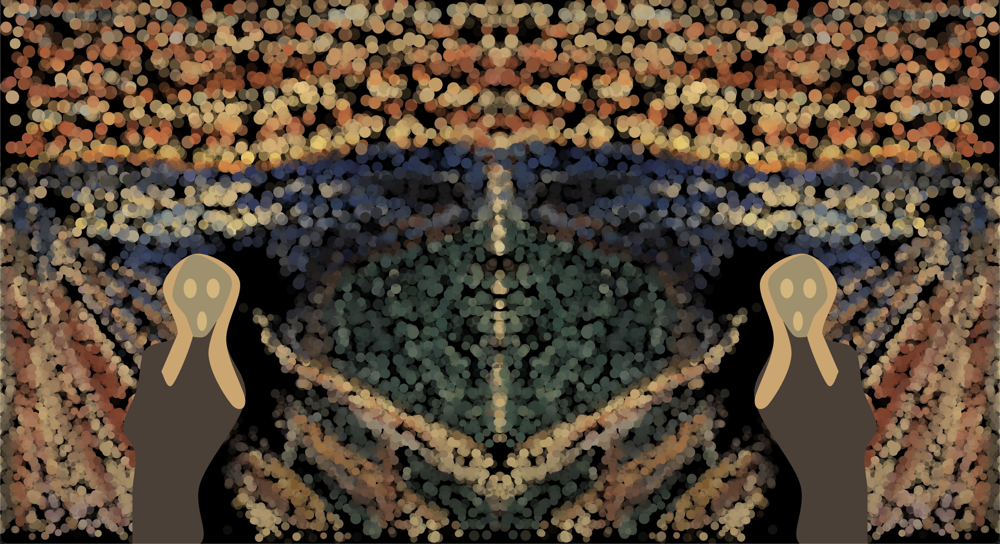
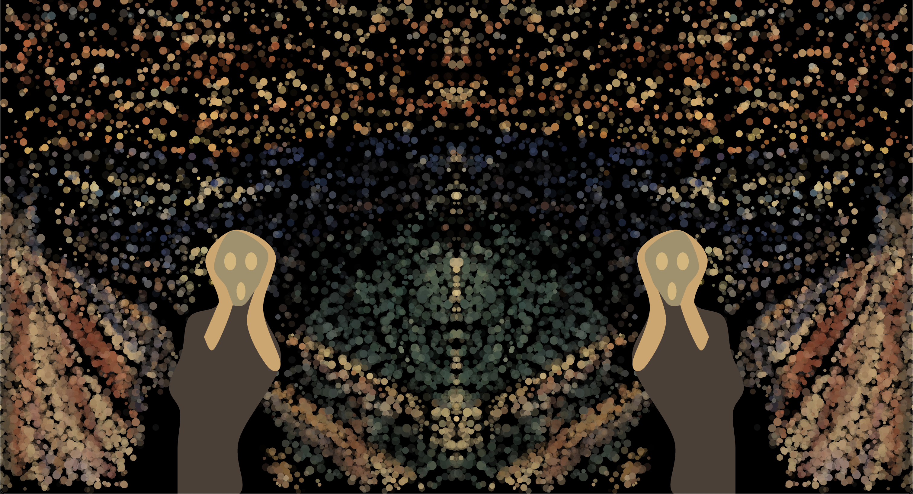

mfal0927_9103_tut 4 group A

## Recreating The Scream

In this individual project, I chose to add perlin noise onto the group code. This is the final group output:

This is the final output of the individual project:

There is a slight update in the circle, the position & size will vary smoothly by using perlin noise. The screamer is also animated with perlin noise.

### How to Interact
Load the page and the animation will automatically play. Try resizing the window to see how the design adjust to different screen sizes.

### Project Details

#### My approach to animation
I chose perlin noise to generate smoother movements. The technique was essential in creating a flowing motion that random functions alone couldn't achieve.

#### Animation details
- Circles
Perlin noise was incorporated in the circle animation by creating a wave pattern to give a subtle nudge to the movement.
- Screamer
Perlin noise was also incorporated in the screamer to give a shaking effect of the screamer to give an effect of someone being scared.

#### Inspiration
I was inspired by the Van Gogh's Starry Night reimagined as an interactive app. I wanted to recreate the flowing motion shown in the video.
[See video](https://www.youtube.com/watch?v=Ph1SEFWcL58&ab_channel=pvrellis)

### Technical details
#### Changes made
- From the original group code, I added a new class for the Wave moving pattern & incorporated perlin noise in it
- I also added perlin noise to the drawScreamer() function
- The perlin noise affected several other functions, such as the setup(), draw(), and initializeCircles()
- I also edited the responsive function to make it responsive because the original one has some issues

#### Tools and technique
- I used perlin noise that we learned during lecture and tutorials. I also watched videos by The Coding Train and others to better understand it. I also interact with chatGPT to understand a more specific code.
